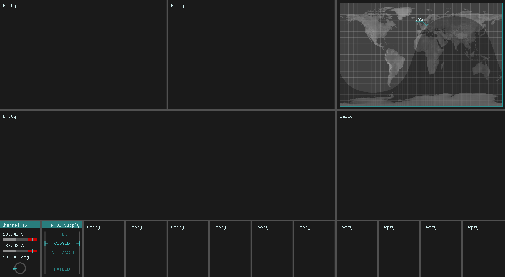

#  Floating Eye

Mission Observation

## Current State



## Hacking

```shell
% git clone --recursive -j4 https://github.com/wose/FloatingEye.git
% cd FloatingEye
% mkdir build && cd build
% cmake -DCMAKE_BUILD_TYPE=Debug -DCMAKE_EXPORT_COMPILE_COMMANDS=1 ..
```
